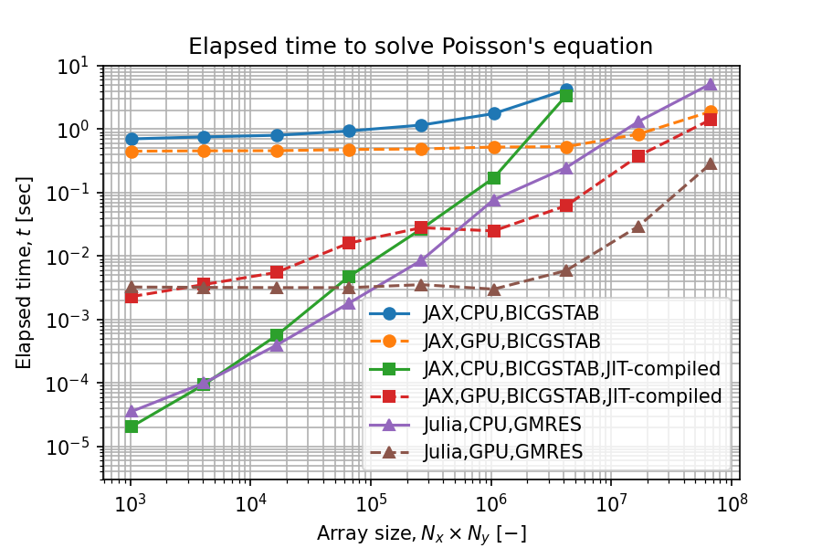

# Python(JAX) と Julia の比較

Pythonは読み書きしやすいプログラミング言語ですが、計算速度が遅いことが玉に瑕です。
これを克服する選択肢として、[JAX](https://github.com/google/jax)と[Julia](https://julialang.org/)を比較しました。

## なぜPython(JAX)とJulia？

候補は以下のものがありました。

* [Python](https://www.python.org/)
  * [NumPy](https://numpy.org/) & [SciPy](https://scipy.org/): コンパイルされたCコードを実行する技術計算ライブラリ
  * [CuPy](https://cupy.dev/): NumPy、SciPyをGPUで実行
  * [cuNumeric](https://github.com/nv-legate/cunumeric): NumPyをGPUで実行。マルチノード対応
  * [Numba](https://numba.pydata.org/): Python関数をJITコンパイル
  * [JAX](https://github.com/google/jax): Python関数をJITコンパイル。自動微分に対応し[TensorFlow](https://www.tensorflow.org/)、[PyTorch](https://pytorch.org/)に続く機械学習ライブラリとして期待
* [Julia](https://julialang.org/): Pythonのように書けて、計算速度はC言語とPythonの間にある{cite:p}`JULIA2012`
* [MATLAB](https://jp.mathworks.com/products/matlab.html): 有償ソフトウェア。製品設計、制御設計のプラットフォーム
* [C++](https://isocpp.org/): GitHubで見かける最近の多くの技術計算オープンソースソフトウェアがC++で記述され、Pythonインターフェースで実行される
* [Fortran](https://fortran-lang.org/): 技術計算言語として長く利用されている。例えば[BLAS](http://www.netlib.org/blas/)の他の多くのライブラリのバックエンド
* [Rust](https://www.rust-lang.org/): 実行速度が速く、デバッグしやすい。

Pythonライブラリの中で、JAXは、NumPy・SciPy、GPU計算、JITコンパイル、自動微分のすべてをカバーする(おそらく唯一)のライブラリです。
一方、Juliaは、前述の機能をカバーした上で、技術計算に特化しています。Pythonと同じく[Jupyter](https://jupyter.org/)環境で逐次実行できます。
MATLABは、[JITコンパイル可能](https://jp.mathworks.com/help/coder/ug/speed-up-mex-generation-by-using-jit-compilation.html)なようですが、ライセンスを購入しなければ使用できません。
C++、Fortranは、習熟やデバッグに時間がかかりそうなので避けました。さらなる高速が必要な時に、再度検討します。
Rustはデバッグしやすいらしいですが、技術計算ライブラリが充実しているようには見えませんでした。
そういうわけで、今回はJAXとJuliaを選択しました。

## 検証環境

Windows11のUbuntu 20.04 on WSL2で実行しました。Windows10 ver. 20H2以降は、WSLでGPUを利用できます。

CPUとGPUは、以下の表のものを用いました。

| 浮動小数点演算性能 (単位: TFLOPS) | FP32 | FP64 |
| :---- | ----: | ----: |
| CPU: AMD Ryzen9 5950X |  | 0.97 |
| GPU: NVIDIA GeForce RTX 3090 | 39.1 | (0.61) |

上記数値は[ベンチマークサイト](https://gadgetversus.com/)を参考にしました。

どちらも2020年秋発売のメインストリーム向けフラグシップなので、CPU計算とGPU計算の比較には適しています。

## インストール

### JAX

[公式のインストール手順](https://github.com/google/jax#installation)にしたがってインストールしました。
WindowsでGPUバージョンのJAXを利用する場合、[CUDA on WSL](https://docs.microsoft.com/ja-jp/windows/ai/directml/gpu-cuda-in-wsl)を利用します。

```{attention}
WSLではないWindows上で実行したい場合、ソースからビルドする必要があります。
```

`pip`パッケージに、CUDAとCuDNNがバンドルされていないので、別途インストールが必要です。
CUDAは[ここ](https://docs.nvidia.com/cuda/wsl-user-guide/index.html#getting-started-with-cuda-on-wsl)、CuDNNは、[ここ](https://docs.nvidia.com/deeplearning/cudnn/install-guide/index.html)に記載された通りの手順で導入しました。後述のJuliaに比べると面倒です。

```{caution}
JAX、CUDA、CuDNNのバージョンを一致させなければ動作しません。
```

### Julia

Julia のインストールは、[公式](https://julialang.org/downloads/)からダウンロードして、解凍してPathを通すだけです。

GPU計算(CUDA)の利用には、[CUDA.jl](https://github.com/JuliaGPU/CUDA.jl)を利用します。
Julia のコマンドプロンプトで以下のコマンド1行だけでセットアップ完了です。

```julia
julia> using Pkg; Pkg.add("CUDA")
```

手順がシンプルで、WindowsとLinuxで導入手順が共通しています。

## 読み書きしやさ

### JAX

JITコンパイルはデコレータ`@jit`で指示します。
インスタンス変数に配列を持つclass内methodのJITコンパイルにはやや面倒な対策が必要でした([公式FAQ](https://jax.readthedocs.io/en/latest/faq.html#how-to-use-jit-with-methods))。
Pythonらしさはなくなりますが、classを使わずに書くのが簡単そうです。
また、jax.numpyではない通常のnumpyがあるとJITコンパイルに失敗するので、膨大なライブラリがあるというPythonの利点を活かせないこともありそうです。

### Julia

classの概念がなく、function (Pythonでいうmethod) で記述します。
JITコンパイルはユーザーが明示的に指示する必要がありません。

しかし、Pythonに比べると、APIドキュメントの情報量が少なく、ライブラリ使い方の理解に時間がかかることが多い印象です。

## 計算時間の比較

### 比較条件

以下のポアソン方程式を周期境界条件で解きました。

$$
\frac{\partial^2 p}{\partial x^2} + \frac{\partial^2 p}{\partial y^2} = \frac{\partial u}{\partial x} + \frac{\partial v}{\partial y}
$$

$$
u = \sin 2 x \\
v = \sin 2 y
$$

ソースコードは、[JAX](poisson_jax)と[Julia](poisson_julia)の通りです。
差文法の実装の違い、線形代数ソルバーの違いがあるために、厳密な比較にはなっていません。

### 比較結果

JIT-compileされたJAXとJuliaが非常に高速であることがわかります。
配列サイズ10万を堺にCPUとGPUの速度が逆転することがわかります。
配列サイズが大きい場合には、CPUとGPUの差はベンチマークサイトの結果通りでした。
GPU計算は自動的に単精度実数として実行されるようです。



## まとめ

JITコンパイルJAXとJuliaが非JITコンパイルJAXに比べて非常に高速であることがわかりました。
非JITコンパイルJAXが通常のPythonと比べてどうなのか、同じアルゴリズムの時にJITコンパイルJAXとJuliaの差はどの程度かは時間があれば調べたいです。

導入しやすさと実装しやすさは、Juliaが明らかに勝っています。Pythonでなければならない理由がない限りは、私はJuliaを選択します。

```{bibliography}
```
